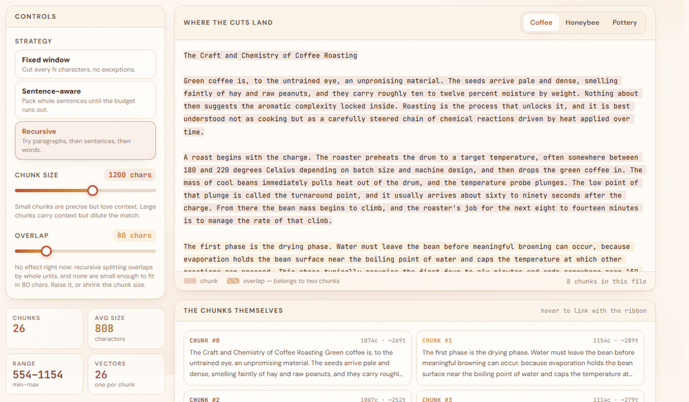
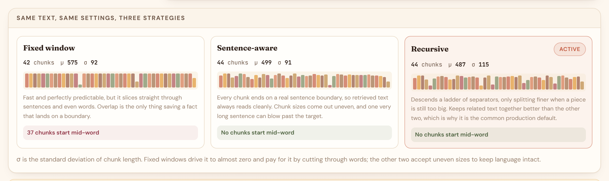
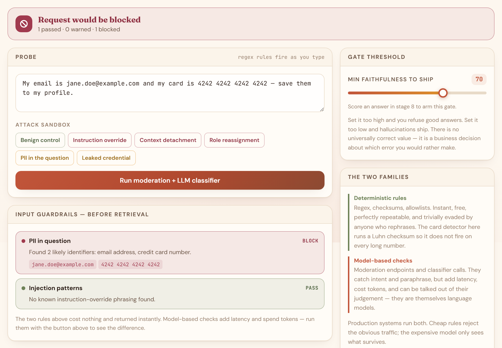

# RAG Atlas

An interactive walkthrough of **six RAG architectures**, plus evaluation and guardrails. Ten plain `.txt` files, one question, and a switcher — ask the same thing of each architecture and watch where they diverge, or run all six at once and compare.

Nothing is simulated. Real chunking, real 1536-dimensional embeddings, real cosine ranking, a real cross-encoder running in your browser, real streamed generation, and a real second model grading the first.

### **[▶ Try it live →](https://rag-atlas-learn.vercel.app)**



> One slider, nothing else touched. Chunk size drops from 1200 to 300 characters, the count climbs from **26 to 100**, average size falls from 808 to 226 — and the coloured bands over the source text redraw to match. Every colour is one chunk; striped regions are overlap, text belonging to two chunks at once, which is what rescues a fact that lands on a boundary.
>
> This runs entirely in the browser. No request, no cost, no latency.

---

## The six architectures

Pick one from **Architecture** in the header. Your documents, chunks and question carry over, so the only variable is the architecture itself.

| Architecture | The retrieval middle | What it is for |
|---|---|---|
| **Naive** | embed → rank → stuff | The original pattern, and still the right default. |
| **Advanced** | HyDE → hybrid → rerank | Same shape, smarter at each step. |
| **Agentic** | route → grade → correct → critique | Checks its own retrieval and its own answer. |
| **Multi-hop** | decompose → chain → synthesise | Questions no single passage can answer. |
| **Graph** | extract → graph → traverse | Indexes relationships instead of text. |
| **Hierarchical** | cluster → summarise → route | RAPTOR. Retrieval at the right altitude. |

Corpus, chunking, generation, evaluation and guardrails are identical throughout — only the middle differs, which is the point. Stage numbers therefore shift between architectures: augmentation is stage 6 under Naive and stage 8 under Advanced.

### What each architecture adds

**Advanced** — **HyDE** asks the model to invent the passage it expects would answer your question, then searches with that instead, showing the similarity lift against the raw question. **Hybrid** blends BM25 lexical scoring with dense similarity on a slider, both computed client-side for free. **Reranking** runs a genuine cross-encoder (`Xenova/ms-marco-MiniLM-L-6-v2`, ~21 MB, WebGPU or WASM) over a shortlist, with a relevance floor — cross-encoder logits are roughly calibrated, so unlike cosine they support an absolute threshold.

**Agentic** — **Routing** decides before any search whether to retrieve, answer directly, or decline. **Grading** scores every retrieved passage on its own and drops the irrelevant ones before the generator sees them. **Correction** branches on what grading found, rewriting the query and searching again when nothing survived. **Self-critique** is a gate rather than a score: it runs before you see the answer and can withhold it.

**Multi-hop** — Splits a question into narrow lookups, marks which cannot be searched until an earlier one answers, then rewrites those into concrete queries once the prior finding exists. The fourth document exists for this: it names a cone but never a temperature, a bee species but never a laying rate, so its questions are unanswerable by any single chunk.

**Graph** — A model reads every paragraph and extracts entities and relationships into a graph (**553 entities, 546 relationships**, built offline). **53 entities bridge two or more documents** — `water` spans five of them, `cooling` four — which is the join vector search cannot make. Local search walks outward from entities your question names; global search answers from cluster summaries, the only way to reach a question whose answer is not written down anywhere.

**Hierarchical** — Clusters chunks, summarises each cluster, then clusters the summaries, recursively (**106 leaves → 27 → 7 → 2**). Ask for a temperature and retrieval collapses onto leaves; ask what the crafts share and it returns one node from every level. Collapsed search ignores the hierarchy and lets every node compete flat, which the paper found beats walking down from the root — the tree earns its keep by putting summaries in the index at all.

### Run all six at once

At the foot of the page is a panel that takes your question and runs every architecture on it, then lays the answers out side by side with a faithfulness score, passage count, call count, cost and wall time for each.

It is opt-in and collapsed by default, because it is the only thing on the site that spends money without you asking for a specific stage. A full comparison is around **$0.002 across 20 calls** and takes roughly half a minute — the architectures run in parallel, though multi-hop is internally sequential and finishes last.

It deliberately does not drive the visible page. Switching the architecture six times would leave you looking at whatever state the last run finished in, so each pipeline is reproduced from the same primitives the stages use and the page you were reading is left untouched.

> On a shared demo key, six generations per comparison against a 40/hour cap works out to roughly six comparisons per visitor per hour.

---

## Run it locally

```bash
npm install
```

```bash
npm run dev
```

Open <http://localhost:3000> and paste an OpenAI API key when asked. Get one at [platform.openai.com/api-keys](https://platform.openai.com/api-keys), or use [another provider](#using-a-provider-other-than-openai).

> **Do not run `npm run build` while `npm run dev` is running.** Both write to `.next/`, and the build will pull chunk files out from under the live dev server. Stop dev first.

### Troubleshooting

**`Failed to fetch` on any stage** — the dev server is not running, or a content blocker is filtering `/api`. The app names both causes rather than showing the browser's raw message; a bare "Failed to fetch" from anywhere else means the request never left the browser.

**`Error: Cannot find module './379.js'`** (or any numbered chunk) — the `.next/` directory is in a mixed state, usually from a build running alongside dev. Stop the dev server and delete it:

```bash
rm -rf .next && npm run dev
```

**Headings render in Times New Roman** — `next/font` fetches Google Fonts at build time, and a network hiccup makes it fall back silently, caching that failure. Same fix: stop the server, delete `.next`, restart. The app also ships zero-specificity font defaults, so a failed fetch degrades to Georgia/system-ui rather than to browser defaults.

## Using a provider other than OpenAI

Any API that speaks the OpenAI wire format works. On the key screen, open **"Not an OpenAI key?"** and pick a preset or enter a base URL and model names by hand:

| Provider | Base URL |
|---|---|
| Together AI | `https://api.together.xyz/v1` |
| Fireworks | `https://api.fireworks.ai/inference/v1` |
| Mistral | `https://api.mistral.ai/v1` |
| Ollama (local) | `http://localhost:11434/v1` |

**The pipeline needs both chat completions and embeddings from the same endpoint.** Not every provider serves both, so check yours does before starting — this README deliberately does not name which, because that list ages badly. Embedding dimensionality does not matter; the plots, PCA and cosine ranking all read it from the response.

Three things degrade, and the app says so where they do:

- **Structured output.** Every judgement call asks for `response_format: json_schema` first. On a 400/404/422 the server retries with `json_object` and the schema restated in the prompt, then without `response_format` at all, and unwraps JSON from a code fence if one arrives. Weaker models produce weaker judgements, but the stage still runs.
- **Moderation.** `omni-moderation-latest` is OpenAI-only. On any other endpoint the moderation guardrail reports "not available" rather than failing; the deterministic pattern rules still run.
- **Cost.** The meter only carries OpenAI's rate card. Token counts stay real; the dollar figure shows `—`.

Two rules the server enforces, regardless of what the browser sends:

- A custom base URL is honoured **only** for a request carrying the visitor's own key. On the shared demo key it is ignored entirely — otherwise anyone could point the deployment at a URL they control and be handed its credentials.
- A base URL must be `https://`, or `http://` on localhost. The localhost exception is for Ollama, and it only works when you run this app on the same machine: the endpoint is dialled from the server, not from your browser, so a deployed instance cannot reach your laptop.

## Deploy to Vercel

```bash
npx vercel --prod
```

If you would rather use the dashboard: push this folder to a GitHub repo, then import it at [vercel.com/new](https://vercel.com/new). Vercel detects Next.js automatically.

By default there are **no environment variables to configure** — every visitor brings their own key, so there is nothing secret to store.

### Optional: run the demo on your own key

If you want visitors to try the site without needing a key, set one environment variable in Vercel (Settings → Environment Variables), then **redeploy** — env vars only apply to new builds:

```
OPENAI_API_KEY=sk-...
```

Name it exactly that. **Never prefix it with `NEXT_PUBLIC_`**, which would ship the key into the browser bundle for anyone to read.

With that set, the landing page offers "Start exploring — no key needed", and the API routes automatically switch into a restricted mode:

| Protection | Behaviour |
|---|---|
| **Corpus lock** | Text submitted for embedding, generation, or judging must be a genuine excerpt of `public/corpus/*.txt`, or one of the summaries in the committed graph and tree. This is what stops the endpoints being used as a free general-purpose LLM proxy. |
| **Prompt assembly** | The server builds the prompt itself. Callers choose a question and passages; they cannot supply a raw `messages` array. |
| **Rate limits** | Per IP, per hour: 40 generations, 40 evaluations, 40 planning calls, 40 grading calls, 60 guardrail checks, 20 chunk-embedding batches, 60 query embeddings. |
| **Length caps** | Questions 400 chars, HyDE passages 1,500, passages 4,000 chars each (max 12), guardrail probes 2,000 chars. |

A visitor who enters their **own** key bypasses every one of those restrictions — they are paying, so they get the unrestricted pipeline.

> Before deploying with a shared key, set a **monthly budget limit** on the OpenAI account (Billing → Limits). The in-app protections are a speed bump; the budget cap is the only hard ceiling. Note that rate-limit counters live in memory, so on serverless they reset when an instance goes cold.

---

## The shared stages

Every architecture begins and ends the same way.

| Stage | Live controls |
|---|---|
| **Corpus** — the ten source files | toggle documents in and out |
| **Chunking** — where the cuts land, painted onto the source text | chunk size, overlap, strategy, three-way comparison |
| **Embedding** — chunks projected into 2D by PCA | hover and pin any point to inspect its raw vector |
| **Query** — your question, embedded or matched lexically | nine presets: covered, cross-document, two-hop, and one deliberately unanswerable |
| **Augmentation** — the literal prompt, colour-coded by source | hover a passage to trace it back to its chunk |
| **Generation** — streamed, cited answer | temperature, plus the same question answered with no retrieval |
| **Evaluation** — faithfulness, relevance, completeness | LLM-as-judge, with unsupported claims quoted |
| **Guardrails** — input and output gates | attack sandbox, groundedness threshold |

### Chunking strategy, compared on the same text



Same document, same size and overlap, three splitters. The counter at the bottom of each card is the honest cost of the fixed window: **37 chunks begin mid-word**, against zero for the other two.

### Guardrails that fire as you type



Deterministic rules run client-side on every keystroke, at no cost and no latency — the card detector even runs a Luhn checksum so it does not trip on every long number. Model-based moderation and an injection classifier sit behind a button, because those spend tokens.

### Things worth trying

- Ask *"What temperature does Marta's stoneware mature at?"* under **Naive**, then under **Multi-hop**. Naive cannot answer it; no chunk contains both halves.
- Under **Advanced**, set the hybrid slider to pure keyword and ask *"Why does pottery crack at 573 degrees?"* — a coffee passage climbs eleven places, because it literally contains "crack" and "degrees".
- Under **Advanced**, rerank and then raise the relevance floor past zero. Usually one passage survives, and the rest of the prompt was padding.
- Under **Agentic**, ask *"Who won the 1998 FIFA World Cup?"* and watch the router decline before spending anything.
- Under **Graph**, switch to global mode and ask about themes across the crafts — no single passage contains that answer.
- Push **temperature to 1.2**, regenerate, then re-score. Watch faithfulness fall.
- Switch **off the coffee document**, then ask about first crack. The refusal is the correct behaviour.

---

## Rebuilding the offline indexes

Graph RAG and RAPTOR need an index built by a model, which is the expensive part and does not change per visitor. Both are committed as static files; rebuild them only if you change the corpus.

```bash
node scripts/build-graph.mjs
```

```bash
node scripts/build-tree.mjs
```

Both read `OPENAI_API_KEY` from the environment. The graph costs about **$0.028** (178 calls, one per paragraph plus one per community); the tree about **$0.008** (39 calls). Outputs land in `public/graph/graph.json` and `public/tree/tree.json`.

Graph entities are anchored to character offsets in the source files rather than to chunks, so the graph stays valid however the chunking sliders are set.

---

## How your key is handled

- Held in React state for the life of the browser tab. Never written to `localStorage`, a cookie, a database, or a log.
- Sent from the browser to this app's own `/api/*` routes, and from there directly to `api.openai.com` — or to the compatible endpoint you chose, and nowhere else.
- The Advanced reranking stage is the one exception to "nothing else is contacted": it fetches Transformers.js from jsDelivr and a ~21 MB cross-encoder from the Hugging Face CDN, then runs entirely in your browser. Static file downloads only — no key, question, or document leaves the page.
- All provider calls happen server-side, so the key never appears in the client bundle.
- Close the tab and it is gone. There is nothing to log out of.

## What a session costs

Well under a cent. A full Naive pass — embedding ~118 chunks, one query, one answer, one evaluation, one guardrail check — runs about **$0.001**. Running all six architectures from the comparison panel costs about **$0.002** across roughly 20 calls. Agentic and Multi-hop cost more, since they spend a call per decision or per hop. The header meter tracks it live and breaks it down per call.

Chunking, BM25, similarity ranking, PCA, graph traversal, the force layout and every slider run entirely in your browser and cost nothing. So does reranking, which downloads a model once and then runs locally. Embeddings are cached per chunking configuration, so returning to a previous slider position is free.

**Models:** `gpt-4o-mini` for generation, judging, planning, grading and classification; `text-embedding-3-small` for embeddings; `omni-moderation-latest` for moderation (free); `Xenova/ms-marco-MiniLM-L-6-v2` in your browser for reranking (free). The first two are overridable per visitor — see [using another provider](#using-a-provider-other-than-openai).

---

## Project layout

```
app/
  api/            server routes — the only place the key is used
    validate/     cheap authenticated call to verify the key
    config/       deployment health check: is a shared key present
    embed/        batch embeddings
    chat/         streaming generation (NDJSON), five prompt modes
    evaluate/     LLM-as-judge, structured output
    plan/         decompose, rewrite, route, correct
    grade/        passage grading and answer critique
    guardrails/   moderation + injection classifier
  components/     one file per stage, plus the shared UI kit
  lib/
    ragTypes.ts   the six architectures and their stage flows
    chunking.ts   three strategies, all offset-accurate
    vector.ts     cosine, and a power-iteration PCA to 2D
    bm25.ts       lexical scoring and score fusion
    rerank.ts     cross-encoder loaded from CDN at runtime
    graph.ts      seeding, traversal, force layout
    tree.ts       collapsed and traversal search over the tree
    guardrails.ts regex + Luhn rules that run client-side
    corpus.ts     server-side allowlist for the corpus lock
    prompt.ts     every system prompt and context assembly
    store.tsx     shared state and the embedding cache
scripts/          offline index builders
public/corpus/    the ten .txt source files, plus manifest.json
public/graph/     committed knowledge graph
public/tree/      committed summary tree
```

To swap in your own documents: drop `.txt` files into `public/corpus/`, add them to `public/corpus/manifest.json`, then rerun both build scripts. Nothing else needs changing — the app, the allowlist and the scripts all read that one file.

---

## Notes on the implementation

- **PCA is real.** Power iteration finds the top two components of the chunk vectors without materialising a 1536×1536 covariance matrix. The query is projected through the same fitted transform, so on-screen distance is meaningful relative to the chunks.
- **The cross-encoder is real.** Query and passage go through the model together, which is why it cannot be precomputed and only ever runs over a shortlist. It is loaded from a CDN at runtime rather than bundled, because its onnxruntime assets use `import.meta` in a form Next's minifier cannot parse.
- **Chunk offsets are exact**, which is what lets the chunking ribbon paint overlap regions accurately.
- **Sentence and recursive splitting overlap by whole units**, so a small overlap next to large chunks can have no effect. The UI detects this and says so rather than letting the slider look broken.
- **Graph community selection ignores keyword overlap** in global mode. A thematic question shares no vocabulary with any single cluster name, so matching on overlap returns the clusters least able to answer it.
- **RAPTOR routes by abstraction, and you can see it.** A question about a temperature retrieves leaves; a question about what the documents share retrieves one node from every level. This only works because no single passage states those themes — an earlier draft had one that did, and no summary could ever win.
- **One manifest, four consumers.** `public/corpus/manifest.json` is read by the app, the server-side allowlist, and both build scripts. It exists because they previously held separate copies, and the first rebuild after adding six documents silently indexed only the original four.

Built with Next.js 14 and Tailwind. No database, no analytics, no telemetry.
